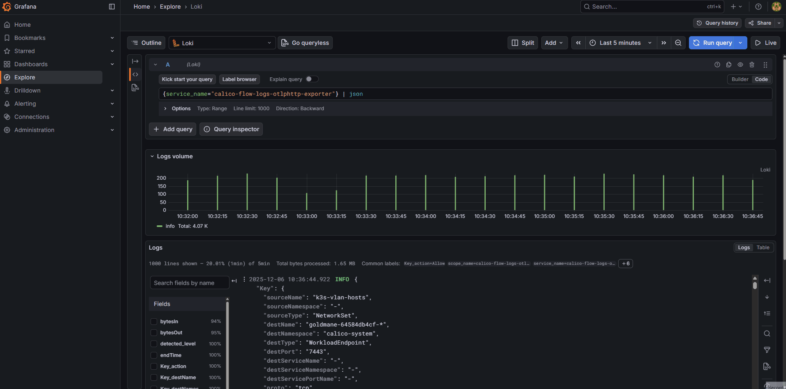
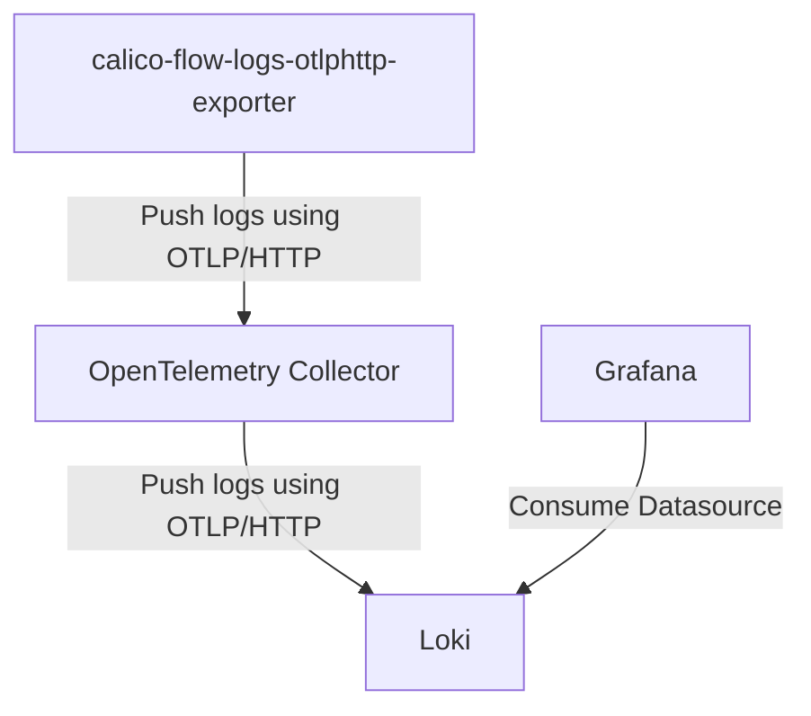

# calico-flow-logs-otlphttp-exporter

> [!WARNING]
> Currently in development, use at your own risk.

Export network flow logs from [Calico](https://docs.tigera.io/calico/latest/observability/flow-logs-api)
using [OTLP/HTTP](https://opentelemetry.io/docs/specs/otlp/#otlphttp).
Uses the [Direct to Collector](https://opentelemetry.io/docs/specs/otel/logs/#direct-to-collector)
approach with the [Logs SDK](https://opentelemetry.io/docs/specs/otel/logs/sdk/)
and [Logging bridge](https://pkg.go.dev/go.opentelemetry.io/contrib/bridges/otelslog).

The motivation for this project is to be able to ingest
network flow logs from Calico into Log Analysis or SIEM
tools using the vendor agnostic OTLP format. This will
allow for Security teams/SOC to have insight into
Kubernetes-contextual network flows. The idea for the
project originates from [this blogpost](https://www.tigera.io/blog/calico-open-source-3-30-exploring-the-goldmane-api-for-custom-kubernetes-network-observability/).

See [#Datamodel](#datamodel) for example payload.

## Disclaimer

This project is a personal open-source initiative and is not affiliated with,
endorsed by, or associated with any of my current or former employers.
All opinions, code, and documentation are solely those of myself and the
individual contributors.

The project is not affiliated with [Project Calico](https://www.tigera.io/project-calico/)
or any of its subsidiaries. The use of the Calico name and/or logo is for
informational purposes only and does not imply any endorsement or affiliation
with the Calico project.

## Compatibility

| Calico version | Compatible |
| :------------- | :--------- |
| `3.30`         | Yes        |
| `3.31`         | Unknown    |

## Installation

> [!NOTE]
> See the [official documentation](https://pkg.go.dev/go.opentelemetry.io/otel/exporters/otlp/otlplog/otlploghttp)
> for a list of all environment variables which can be set for the OTLP Log HTTP exporter.

### Helm

> [!WARNING]
> The default installation uses Goldmanes own certificates for mTLS
> between calico-flow-logs-otlphttp-exporter and Goldmane, this
> is not a recommended practice. See the
> [Calico documentation](https://docs.tigera.io/calico/latest/operations/certificate-management)
> for recommended methods to secure communication using certificates.

1. Create ImagePullSecret:
    ```bash
    docker login ghcr.io -u ghp
    <Paste Personal Access Token with read-only access to GitHub Packages>
    kubectl create secret generic \
        --namespace calico-system \
        calico-flow-logs-otlphttp-exporter-regcred \
        --from-file=.dockerconfigjson=$HOME/.docker/config.json \
        --type kubernetes.io/dockerconfigjson
    ```
1. Pass created ImagePullSecret using `values.yaml`:
    ```yaml
    imagePullSecrets:
      - name: calico-flow-logs-otlphttp-exporter-regcred
    ```
1. Set GitHub Access Token
    ```bash
    read -s ACCESS_TOKEN
    <Paste Personal Access Token with read-only access to repository content>
    ```
1. Setup Helm chart repository:
    ```bash
    helm repo add \
        --username ghp \
        --password $ACCESS_TOKEN \
        calico-flow-logs-otlphttp-exporter \
        https://raw.githubusercontent.com/FredrickB/calico-flow-logs-otlphttp-exporter/gh-pages
    helm repo update
    ```
1. Install Helm release:
    ```bash
    helm upgrade \
        --install \
        --namespace calico-system \
        calico-flow-logs-otlphttp-exporter \
        calico-flow-logs-otlphttp-exporter/calico-flow-logs-otlphttp-exporter
    ```

## Datamodel

The exporter forwards `Flow` in [./protos/api.proto](./protos/api.proto)
payload. 

> [!NOTE]
> Numerical enums are converted to strings.

Example output:

```json
{
  "Key": {
    "sourceName": "longhorn-manager-*",
    "sourceNamespace": "longhorn-system",
    "sourceType": "WorkloadEndpoint",
    "destName": "instance-manager-318f1eac2bc7c775b7a6d2e68e9e2800",
    "destNamespace": "longhorn-system",
    "destType": "WorkloadEndpoint",
    "destPort": "8503",
    "destServiceName": "-",
    "destServiceNamespace": "-",
    "destServicePortName": "-",
    "proto": "tcp",
    "reporter": "Src",
    "action": "Allow",
    "policies": {
      "enforcedPolicies": [
        {
          "kind": "CalicoNetworkPolicy",
          "namespace": "longhorn-system",
          "name": "allow-same-namespace",
          "tier": "default",
          "action": "Allow"
        }
      ],
      "pendingPolicies": [
        {
          "kind": "CalicoNetworkPolicy",
          "namespace": "longhorn-system",
          "name": "allow-same-namespace",
          "tier": "default",
          "action": "Allow"
        }
      ]
    }
  },
  "startTime": "1764970845",
  "endTime": "1764970860",
  "sourceLabels": [
    "app.kubernetes.io/instance=longhorn",
    "app.kubernetes.io/managed-by=Helm",
    "app.kubernetes.io/name=longhorn",
    "app.kubernetes.io/version=v1.8.1",
    "app=longhorn-manager",
    "controller-revision-hash=5bb8c89b95",
    "helm.sh/chart=longhorn-1.8.1",
    "longhorn.io/admission-webhook=long horn-admission-webhook",
    "longhorn.io/conversion-webhook=longhorn-conversion-webhook",
    "longhorn.io/recovery-backend=longhorn-recovery-backend",
    "pod-template-generation=2"
  ],
  "destLabels": [
    "longhorn.io/component=instance-manager",
    "longhorn.io/data-engine=v1",
    "longhorn.io/instance-manager-image=imi-7d4dc4d4",
    "longhorn.io/instance-manager-type=aio",
    "longhorn.io/managed-by=longhorn-manager",
    "longhorn.io/node=k8s-worker-2"
  ],
  "packetsIn": "11",
  "packetsOut": "14",
  "bytesIn": "957",
  "bytesOut": "1226",
  "numConnectionsStarted": "1",
  "numConnectionsCompleted": "1",
  "numConnectionsLive": "1"
}
```

## Demo

Search logs in Grafana using Loki as a Datasource
after ingesting logs to the [Loki OTLP endpoint](https://grafana.com/docs/loki/latest/send-data/otel/)
from OpenTelemetry Collector.

> [!NOTE]
> Using OpenTelemetry Collector as layer between calico-flow-logs-otlphttp-exporter
> and Loki is optional, you can point the exporter directly at Lokis OTLP endpoint.



Architecture:



## Monitoring

There is a [Loki Grafana dashboard](./docs/monitoring/loki-grafana-dashboard.json)
which can be imported to view the state of flows when logs are sent to a [Loki OTLP
endpoint](https://grafana.com/docs/loki/latest/send-data/otel/).

## Development

> [!NOTE]
> See the [official documentation](https://pkg.go.dev/go.opentelemetry.io/otel/exporters/otlp/otlplog/otlploghttp)
> for a list of all environment variables which can be set for the OTLP Log HTTP exporter.

### Prerequisites

- `go` >= `1.24`
- `protoc` >= `3.21.12`
- `make`
- `kubectl`
- `base64`
- `docker` >= `28.2.1`
- Calico ([installation documentation](https://docs.tigera.io/calico/latest/getting-started/))
- Goldmane running in namespace `calico-system` ([installation documentation](https://docs.tigera.io/calico/latest/observability/enable-whisker#enable-the-flow-logs-api))
- `dlv` (optional, for debugging, [installation documentation](https://github.com/go-delve/delve))
- `k3d` (optional, for setting up a local development cluster, [installation documentation](https://k3d.io/v5.8.3/#releases))

### Setup

1. Install development tools: `make install-development-packages`
1. Fetch the protobufs from the Calico project: `make fetch-protobuf-definition`
1. Generate code from protobufs `make generate-code-from-protobuf`
1. Add line to `/etc/hosts` in order to be able to use Goldmane certs for running locally:
    ```
    127.0.0.1 goldmane
    ```
1. (Optional, requires `docker`) setup k3d cluster `make setup-k3d`

### Running

> [!WARNING]
> For development we copy the certificates from a Goldmane
deployment running in the cluster directly. Do not use this
approach in production environments, this is just for development.

1. (Optional) start k3d cluster `make start-k3d`
1. Port-forward the Goldmane service: `make port-forward-goldmane [GOLDMANE_NAMESPACE=<goldmane namespace>]`
1. Copy the certificates from a running instance of Goldmane: `make copy-goldmane-certs-from-kubernetes-deployment [GOLDMANE_NAMESPACE=<goldmane namespace>]`
1. Start the otel-collector, Loki and Grafana: `make docker-compose-up`
1. Run project: `make run [OTEL_EXPORTER_OTLP_ENDPOINT=http://localhost:3100/otlp]` (by default OpenTelemetry Collector is used, you can override to use Loki directly)
   1. Optionally, run `make debug [OTEL_EXPORTER_OTLP_ENDPOINT=http://localhost:3100/otlp]` to debug using `dlv`
1. [Open Grafana Explore with Loki search + JSON parsing enabled](http://localhost:3000/explore?schemaVersion=1&panes=%7B%22fns%22:%7B%22datasource%22:%22P8E80F9AEF21F6940%22,%22queries%22:%5B%7B%22refId%22:%22A%22,%22expr%22:%22%7Bservice_name%3D%5C%22calico-flow-logs-otlphttp-exporter%5C%22%7D%20%7C%20json%22,%22queryType%22:%22range%22,%22datasource%22:%7B%22type%22:%22loki%22,%22uid%22:%22P8E80F9AEF21F6940%22%7D,%22editorMode%22:%22code%22,%22direction%22:%22backward%22%7D%5D,%22range%22:%7B%22from%22:%22now-1h%22,%22to%22:%22now%22%7D,%22panelsState%22:%7B%22logs%22:%7B%22visualisationType%22:%22logs%22%7D%7D,%22compact%22:false%7D%7D&orgId=1)
    - Username: `admin123`
    - Password: `admin123`
1. (Optional) stop k3d cluster `make stop-k3d`

#### Running as container

1. (Optional) start k3d cluster `make start-k3d`
1. Port-forward the Goldmane service: `make port-forward-goldmane [GOLDMANE_NAMESPACE=<goldmane namespace>]`
1. Copy the certificates from a running instance of Goldmane: `make copy-goldmane-certs-from-kubernetes-deployment [GOLDMANE_NAMESPACE=<goldmane namespace>]`
1. Start the otel-collector, Loki and Grafana: `make docker-compose-up`
1. Build container image: `make build-container-image`
1. Run the container image: `make run-container`
1. (Optional) stop k3d cluster `make stop-k3d`

#### Running as Helm release

##### Prerequisites

1. OpenTelemetry-Collector installed:
   1. Namespace must be `opentelemetry-collector`
   1. Name of Service for OpenTelemetry-Collector must be `opentelemetry-collector`
1. Login to ghcr.io:
    ```bash
    docker login ghcr.io -u ghp
    <Paste Personal Access Token>
    ```
1. Create an imagepullsecret from docker config:
    ```bash
    kubectl create secret generic ghcr-io-regcred \
    -n calico-system \
    --from-file=.dockerconfigjson=$HOME/.docker/config.json \
    --type kubernetes.io/dockerconfigjson
    ```
1. (Optional) Adapt values in `hack/charts/calico-flow-logs-otlphttp-exporter/override.yaml`

##### Install Helm chart from local directory

1. Install Helm release:
    ```bash
    make install-helm-chart-from-local-dir
    ```

##### Install Helm chart from private registry

1. Login to GitHub Packages private chart repository
    ```bash
    read -s ACCESS_TOKEN
    <Paste Personal Access Token with read-only access for repository content>
    ```
1. Setup private helm chart repository:
    ```bash
    make setup-private-helm-chart-repository
    ```
1. Install Helm release:
    ```bash
    make install-helm-chart-from-private-chart-repository
    ```

## Contributors

<!-- readme: erikroed,collaborators,contributors/ -start -->
<table>
	<tbody>
		<tr>
            <td align="center">
                <a href="https://github.com/erikroed">
                    
                    <br />
                    <sub><b>Erik</b></sub>
                </a>
            </td>
            <td align="center">
                <a href="https://github.com/FredrickB">
                    
                    <br />
                    <sub><b>Fredrick Biering</b></sub>
                </a>
            </td>
		</tr>
	<tbody>
</table>
<!-- readme: erikroed,collaborators,contributors/ -end -->
